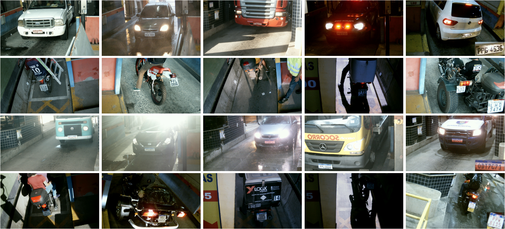

# RodoSol-ALPR Dataset

This dataset, called RodoSol-ALPR dataset, contains 20,000 images captured by static cameras located at pay tolls owned by the *Rodovia do Sol* (RodoSol) concessionaire, which operates 67.5 kilometers of a highway (ES-060) in the Brazilian state of Espírito Santo. It has been introduced in our VISAPP paper [[PDF]](./pdfs/laroca2022cross.pdf).

There are images of different types of vehicles (e.g., cars, motorcycles, buses and trucks), captured during the day and night, from distinct lanes, on clear and rainy days, and the distance from the vehicle to the camera varies slightly. All images have a resolution of 1,280 × 720 pixels.

An important feature of the proposed dataset is that it has images of two different LP layouts: Brazilian and Mercosur (to maintain consistency with previous works, we refer to “Brazilian” as the standard used in Brazil before the adoption of the Mercosur standard). All Brazilian LPs consist of three letters followed by four digits, while the initial pattern adopted in Brazil for Mercosur LPs consists of 3 letters, 1 digit, 1 letter and 2 digits, in that order. In both layouts, car LPs have the seven characters arranged in one row, whereas motorcycle LPs have three characters in one row and four characters in another. Even though these LP layouts are very similar in shape and size, there are considerable differences in their colors and also in the font of the characters.

Here are some examples from the dataset:  

Note: we show a zoomed-in version of the vehicle’s LP in the bottom right corner of the images in the last column for better viewing of the LP layouts.
<br>

The 20,000 images are divided as follows: 5,000 images of cars with Brazilian LPs; 5,000 images of motorcycles with Brazilian LPs; 5,000 images of cars with Mercosur LPs; and 5,000 images of motorcycles with Mercosur LPs. For the sake of simplicity of definitions, here “car” refers to any vehicle with four wheels or more (e.g., passenger cars, vans, buses, trucks, among others), while “motorcycle” refers to both motorcycles and motorized tricycles.

We randomly split the RodoSol-ALPR dataset as follows: 8,000 images for training, 8,000 images for testing and 4,000 images for validation, following the split protocol (i.e., 40%/40%/20%) adopted in the SSIG-SegPlate and [UFPR-ALPR](https://github.com/raysonlaroca/ufpr-alpr-dataset) datasets. We preserved the percentage of samples for each vehicle type and LP layout, for example, there are 2,000 images of cars with Brazilian LPs in each of the training and test sets, and 1,000 images in the validation one. For reproducibility purposes, the subsets generated are explicitly available along with the proposed dataset.

Every image has the following information available in a text file: the vehicle’s type (car or motorcycle), the LP’s layout (Brazilian or Mercosul), its text (e.g., ABC-1234), and the position (x, y) of each of its four corners. We labeled the corners instead of just the LP bounding box to enable the training of methods that explore LP rectification, as well as the application of a wider range of data augmentation techniques.

Regarding privacy concerns related to our dataset, we remark that in Brazil the LPs are related to the respective vehicles, i.e., no public information is available about the vehicle drivers/owners. Moreover, all human faces (e.g., drivers or RodoSol’s employees) were manually redacted (i.e., blurred) in each image.

The full details are in our [paper](./pdfs/laroca2022cross.pdf).

## How to obtain the dataset

The RodoSol-ALPR dataset is released for academic research only and is free to researchers from educational or research institutes for **non-commercial purposes**. 

To be able to download the dataset, please read carefully [**this license agreement**](./pdfs/license-agreement.pdf), fill it out and send it back to the first author ([rblsantos@inf.ufpr.br](mailto:rblsantos@inf.ufpr.br)). **Your e-mail must be sent from a valid university account** (.edu, .ac or similar).

In general, a download link will take 1-3 business days to issue. Failure to follow the instructions may result in no response.

## Citation

If you use the RodoSol-ALPR dataset in your research, please cite our paper:

* R. Laroca, E. V. Cardoso, D. R. Lucio, V. Estevam, and D. Menotti, “On the Cross-dataset Generalization in License Plate Recognition” in International Conference on Computer Vision Theory and Applications (VISAPP), Feb 2022, pp. 1–13. [[arXiv]](https://arxiv.org/abs/2201.00267)

```
@inproceedings{laroca2022cross,
  title = {On the Cross-dataset Generalization in License Plate Recognition},
  author = {R. {Laroca} and E. V. {Cardoso} and D. R. {Lucio} and V. {Estevam} and D. {Menotti}},
  year = {2022},
  month = {Feb},
  booktitle = {International Conference on Computer Vision Theory and Applications (VISAPP)},
  volume = {},
  number = {},
  pages = {1-13},
  doi = {},
  issn={2184-4321},
}
```

## Related publications

A list of all papers on ALPR published by us can be seen [here](https://scholar.google.com/scholar?hl=pt-BR&as_sdt=0%2C5&as_ylo=2018&q=allintitle%3A+plate+OR+license+OR+vehicle+author%3A%22Rayson+Laroca%22&btnG=).

## Contact

Please contact Rayson Laroca ([rblsantos@inf.ufpr.br](mailto:rblsantos@inf.ufpr.br)) with questions or comments.
